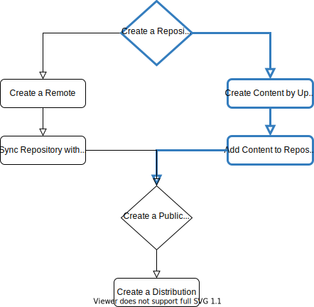

# Package Uploads



Next to synchronization, direct upload is the second way to obtain APT content for your Pulp instance.


## Quickstart Example

A working example for uploading a `.deb` package and hosting it in a `pulp_deb` repository:

```bash
NAME='quickstart-upload-vim-amd64'
pulp deb repository create --name=${NAME}
wget ftp.de.debian.org/debian/pool/main/v/vim/vim_9.0.1378-2_amd64.deb
pulp deb content upload --repository=${NAME} --file=vim_9.0.1378-2_amd64.deb
pulp deb publication create --repository=${NAME}
pulp deb distribution create --name=${NAME} --base-path=${NAME} --repository=${NAME}
```

By default a package uploaded directly to a repository like this will be placed in the `upload` component of the `pulp` distribution.
It follows we can configure our example repo in the `/etc/apt/sources.list` file on a consuming host as follows:

```bash
deb http://<your_pulp_host>/pulp/content/quickstart-uploaded-vim-amd64/ pulp upload
```

!!! note
    You can think of the upload command as declarative and idempotent.
    In other words, you can upload the same package to your Pulp repository multiple times, and the task will succeed each time, but only the first time will result in any changes to your Pulp repository.


!!! warning
    It is possible to have an uploaded package added to an arbitrary distribution-component combination, by supplying the `distribution` and `component` parameters to the package upload API endpoint.
    However, at the time of writing it is not possible to do this via Pulp CLI.
    It is also not possible to use Pulp CLI to create a release content in order to customize the release file fields.


## Create a Structured Repo Manually

To get around Pulp CLI limitations from the quickstart example, we present the following scripted example that uses `http`  and `jq` to talk directly to the API.

!!! note
    You may also want to have a look at the [pulpcore upload documentation](https://staging-docs.pulpproject.org/pulpcore/docs/user/guides/upload-publish/).


**Setup**

```bash
#!/usr/bin/env bash
set -e

export PULP_URL=${PULP_URL:-http://localhost:24817}

# Poll a Pulp task until it is finished.
wait_until_task_finished() {
    echo "Polling the task until it has reached a final state."
    local task_url=${1}
    while true
    do
        local response=$(http ${task_url})
        local state=$(echo ${response} | jq -r .state)
        case ${state} in
            failed|canceled)
                echo "Task in final state: ${state}"
                exit 1
                ;;
            completed)
                echo "${task_url} complete."
                break
                ;;
            *)
                echo "Still waiting..."
                sleep 1
                ;;
        esac
    done
}
```

**Workflow**

```bash
#!/usr/bin/env bash

set -ev

trap "rm frigg_1.0_ppc64.deb" EXIT

# user defined values
NAME=manual-upload-frigg-ppc64
DIST=pulp
COMP=upload

RELEASE_FILE_FIELDS=(
  codename=${DIST}
  suite=${DIST}
  version=1
  origin=myorigin
  label=mylabel
  description=mydescription
)

# download a package
wget https://fixtures.pulpproject.org/debian/pool/asgard/f/frigg/frigg_1.0_ppc64.deb

# create a repo and distribution
REPO_HREF=$(http ${PULP_URL}/pulp/api/v3/repositories/deb/apt/ name=${NAME} | jq -r .pulp_href)
TASK_HREF=$(http ${PULP_URL}/pulp/api/v3/distributions/deb/apt/ name=${NAME} base_path=${NAME} repository=${REPO_HREF} | jq -r .task)
wait_until_task_finished ${PULP_URL}${TASK_HREF}

# Create a Release, ReleaseArchitecture, and ReleaseComponent content to set various release file fields and add them to the repo in a single action
TASK_HREF=$(http ${PULP_URL}/pulp/api/v3/content/deb/releases/ repository=${REPO_HREF} distribution=${DIST} ${RELEASE_FILE_FIELDS[@]} architectures:='["amd64", "ppc64"]' components:=['"'${COMP}'"'] | jq -r .task)
wait_until_task_finished ${PULP_URL}${TASK_HREF}

# upload the package to create Package and PackageReleaseComponent content and add it to the repo in a single action
# the ReleaseComponent and ReleaseArchitecture were created in the previous step but could have been created in this step
TASK_HREF=$(http --form ${PULP_URL}/pulp/api/v3/content/deb/packages/ file@frigg_1.0_ppc64.deb repository=${REPO_HREF} distribution=${DIST} component=${COMP} | jq -r .task)
wait_until_task_finished ${PULP_URL}${TASK_HREF}

# publish our repo
TASK_HREF=$(http ${PULP_URL}/pulp/api/v3/publications/deb/apt/ repository=${REPO_HREF} | jq -r .task)
wait_until_task_finished ${PULP_URL}${TASK_HREF}

# check that our repo has one of the package index folders we would expect
http --check-status ${PULP_URL}/pulp/content/${NAME}/dists/${DIST}/${COMP}/binary-ppc64/Packages
```

The final command from the sctipt should return a `200 OK` response.
